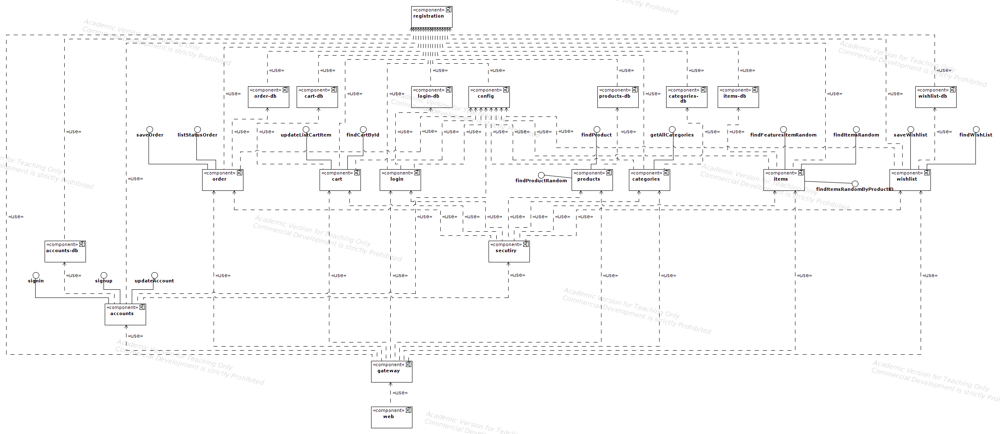
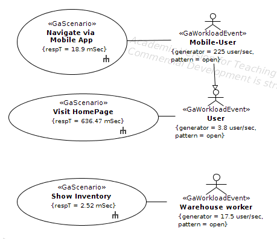
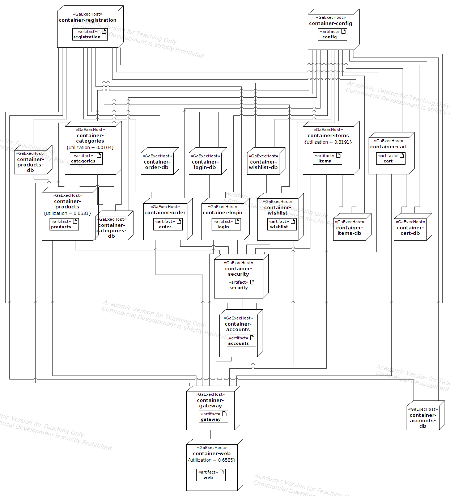

# E-Shopper UML models - Initial

Static View through UML Component Diagram

Dynamic View through UML Use Case Diagram

Sequence Diagram of Scenario "Navigate via Mobile App"

Sequence Diagram of Scenario "Show Inventory.png"

Sequence Diagram of Scenario "Visit HomePage.png"

Deployment View through UML Deployment Diagram

