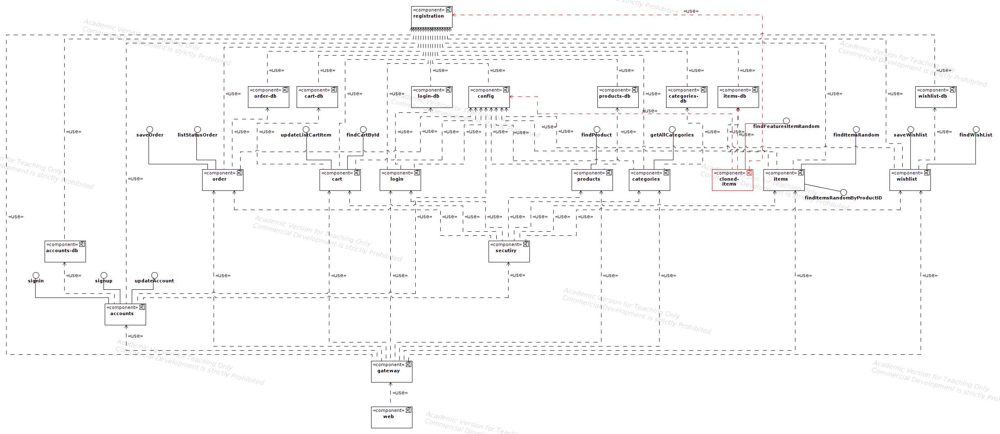
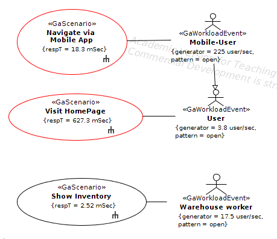
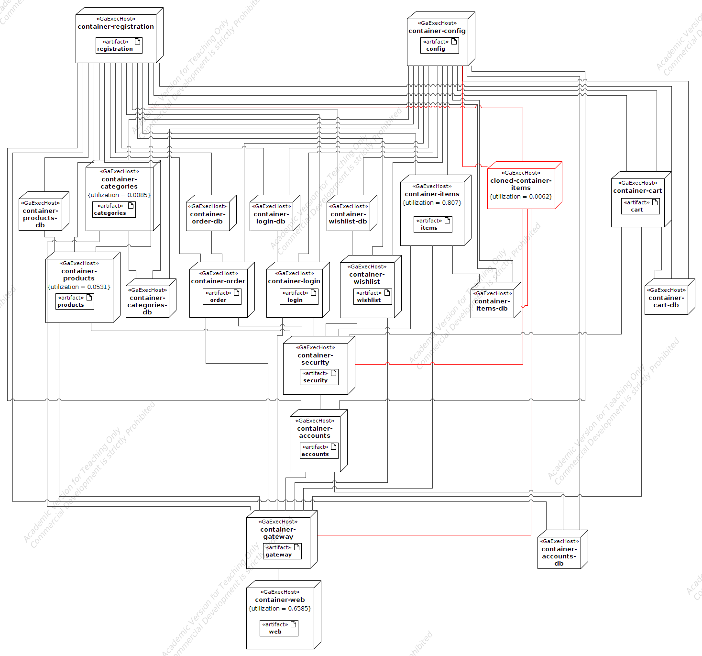

# E-Shopper UML models - Move Operation Items findfeatureitemsrandom

Static View through UML Component Diagram

Dynamic View through UML Use Case Diagram

Sequence Diagram of Scenario "Visit HomePage"

Deployment View through UML Deployment Diagram

