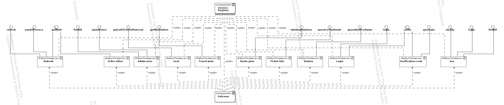
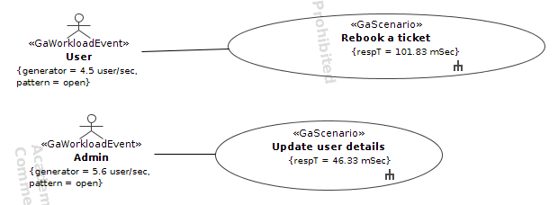
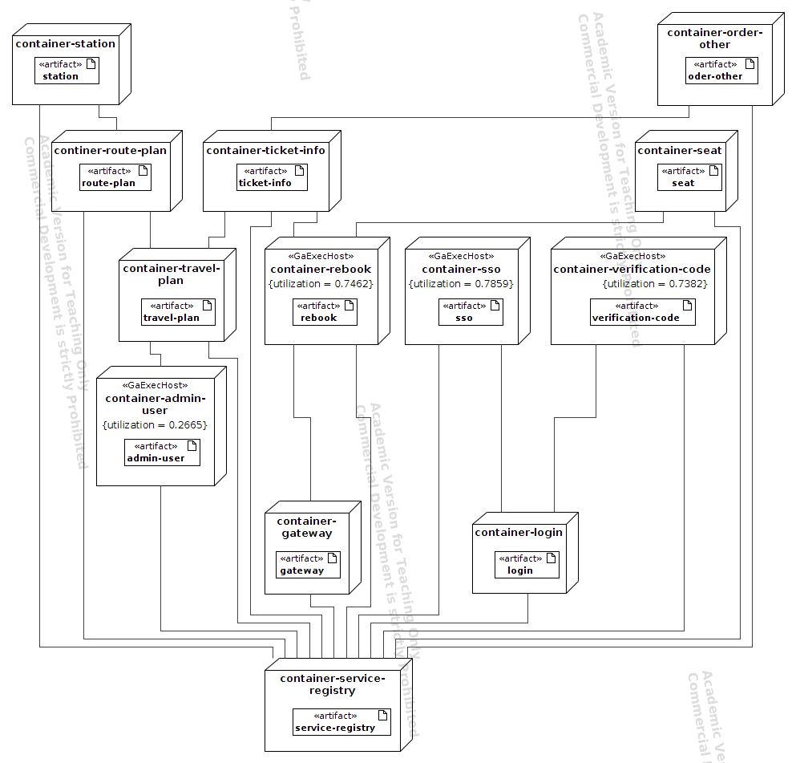

# Train-Ticket UML models - Initial Model

Static View through UML Component Diagram

Dynamic View through UML Use Case Diagram

Sequence Diagram of the scenario "Rebook a ticket"

Sequence Diagram of the scenario "Update user details"

Deployment View through UML Deployment Diagram

