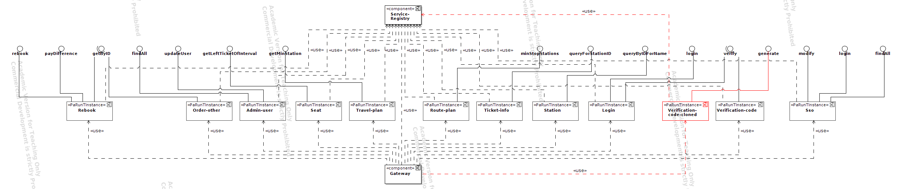
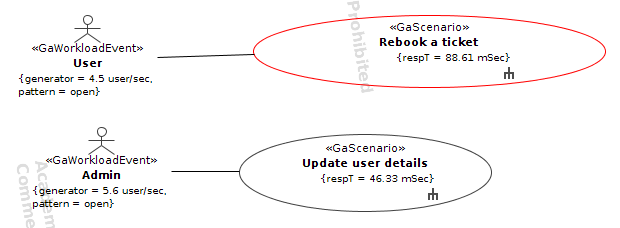
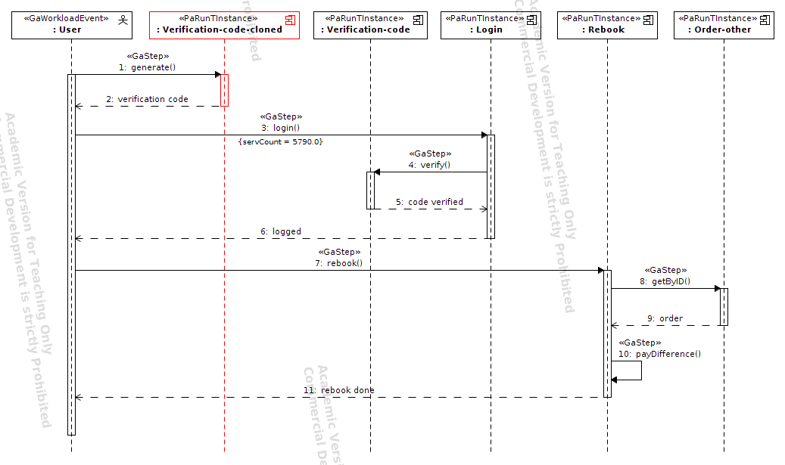
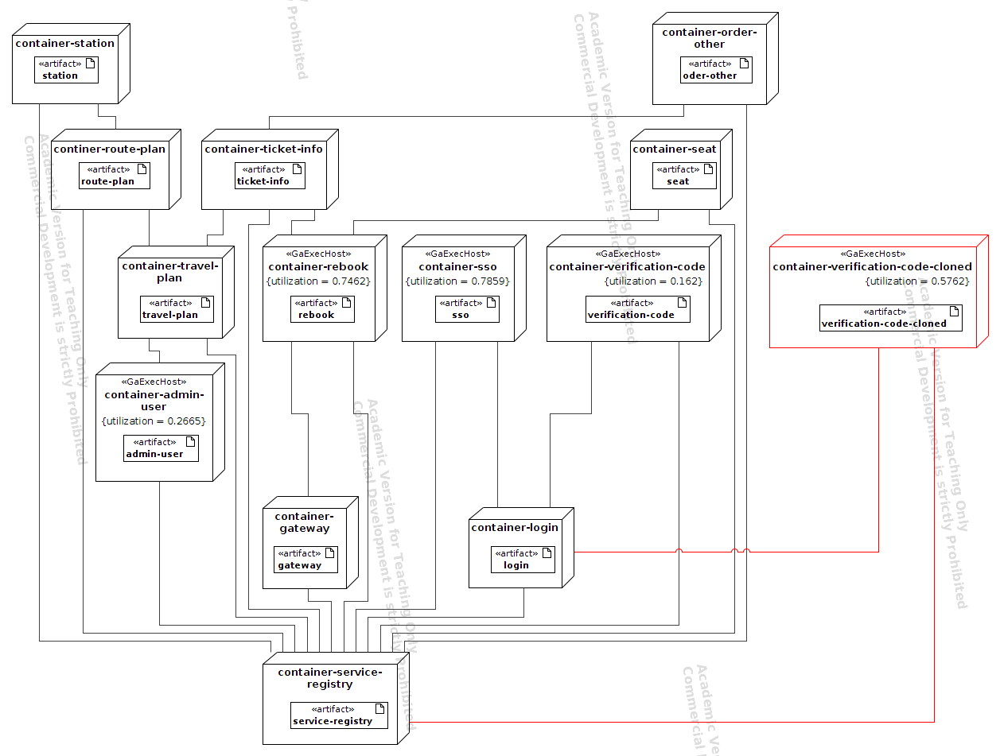

# Train-Ticket UML models - Moveop Verification-code generate

Static View through UML Component Diagram

Dynamic View through UML Use Case Diagram

Sequence Diagram of the Scenario "Rebook a Ticket"

Deployment View through UML Deployment Diagram

